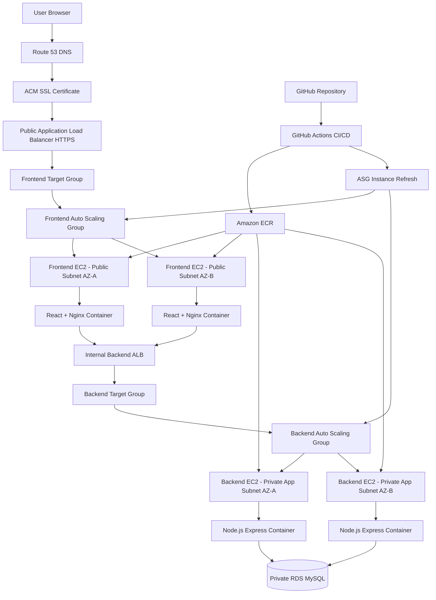
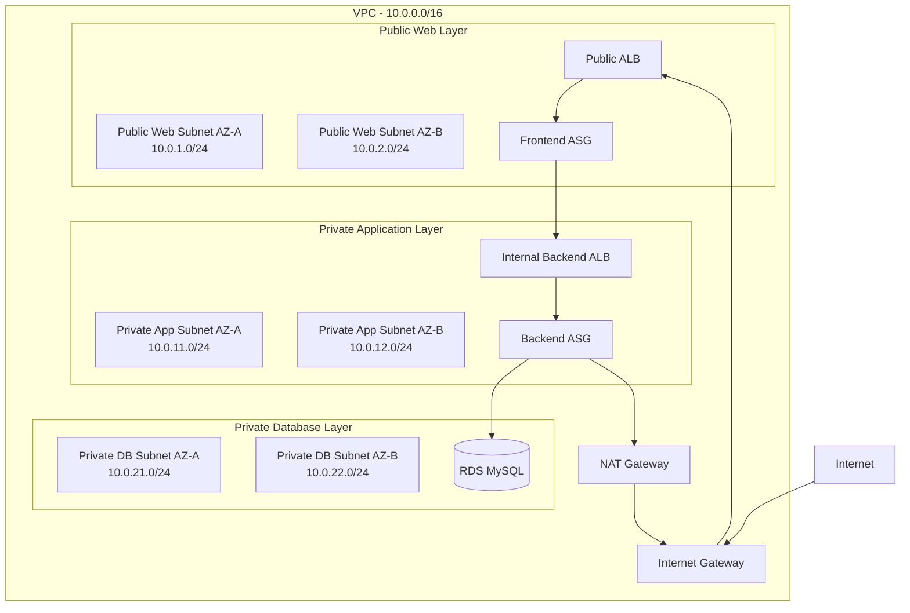
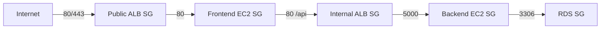
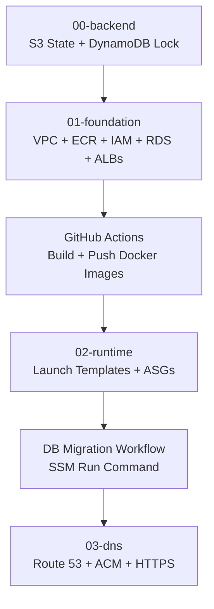
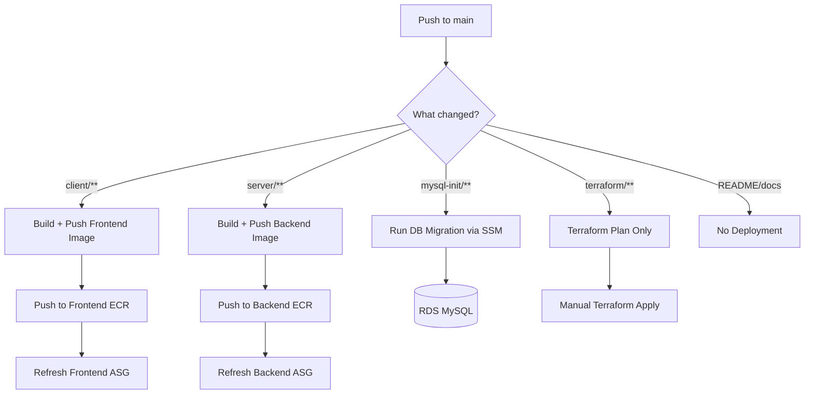
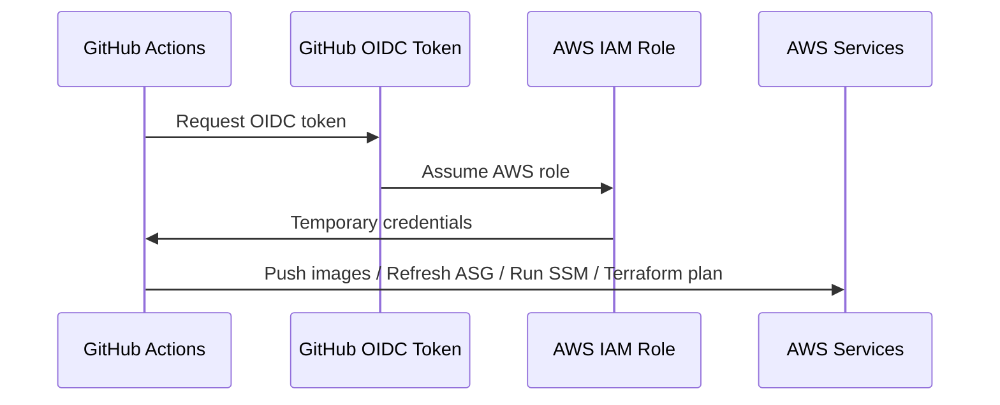
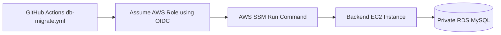
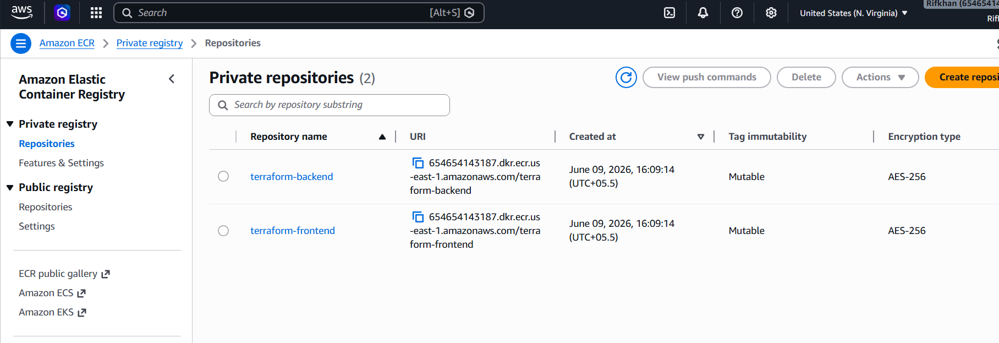
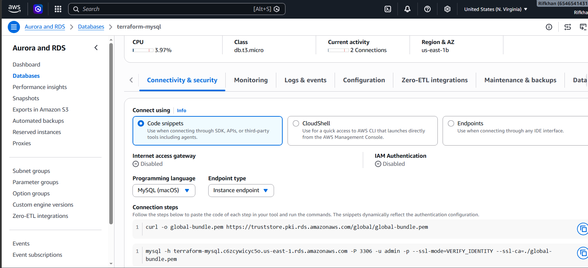

# 🚀 BlogOps 3-Tier DevOps Platform on AWS

> **Production-style fullstack application deployed on AWS using Docker, ECR, Terraform, Auto Scaling, ALB, RDS, Route 53, ACM, GitHub Actions, OIDC, and CI/CD.**


---

## 📌 Project Overview

This project is a **fullstack DevOps platform** built to demonstrate real-world AWS infrastructure, containerization, automation, CI/CD, and production deployment practices.

The application includes:

- React + Vite frontend
- Node.js + Express backend
- MySQL database on Amazon RDS
- JWT authentication
- Blog post CRUD
- Categories
- Comments
- Admin/author role-based access
- Dockerized frontend and backend
- Terraform-managed AWS infrastructure
- GitHub Actions CI/CD with AWS OIDC
- Auto Scaling Group based rolling deployments
- Private backend and database layers
- HTTPS custom domain using Route 53 and ACM

---

## 🧠 What This Project Demonstrates

It demonstrates:

- AWS 3-tier architecture design
- Infrastructure as Code using Terraform
- Docker image build and deployment using ECR
- Auto Scaling Group and Launch Template deployment
- Public and internal Application Load Balancer setup
- Secure private RDS MySQL architecture
- GitHub Actions CI/CD with OIDC IAM role assumption
- Path-based CI/CD workflows
- Database migration using SSM Run Command
- Remote Terraform state using S3 and DynamoDB locking
- HTTPS with ACM and Route 53
- Cost-aware production-style infrastructure

---

## 🏗️ Final AWS Architecture



---

## 🌐 Network Architecture



---

## 🔐 Security Group Flow



Security rules:

| Layer | Allowed Inbound |
|---|---|
| Public ALB | HTTP 80 and HTTPS 443 from internet |
| Frontend EC2 | HTTP 80 only from Public ALB SG |
| Internal ALB | HTTP 80 only from Frontend EC2 SG |
| Backend EC2 | Port 5000 only from Internal ALB SG |
| RDS MySQL | Port 3306 only from Backend EC2 SG |

---

## 🧰 Tech Stack

### Application

| Layer | Technology |
|---|---|
| Frontend | React + Vite |
| Backend | Node.js + Express |
| Database | MySQL on Amazon RDS |
| Authentication | JWT |
| Web Server | Nginx |
| Containers | Docker |

### AWS / DevOps

| Category | Services / Tools |
|---|---|
| IaC | Terraform |
| Compute | EC2, Launch Template, Auto Scaling Group |
| Load Balancing | Public ALB, Internal ALB |
| Container Registry | Amazon ECR |
| Database | Amazon RDS MySQL |
| Network | VPC, Subnets, IGW, NAT Gateway, Route Tables |
| Security | IAM, Security Groups, OIDC, Least Privilege |
| DNS + SSL | Route 53, ACM |
| CI/CD | GitHub Actions |
| Remote Commands | AWS Systems Manager Run Command |
| State Management | S3 Remote State + DynamoDB Locking |

---

## 📁 Project Structure

```text
.
├── client/                         # React + Vite frontend
├── server/                         # Node.js + Express backend
├── mysql-init/                     # SQL schema and seed files
│   ├── 01-schema.sql
│   └── 02-seed.sql
├── .github/
│   └── workflows/
│       ├── deploy-frontend.yml     # Frontend-only CI/CD
│       ├── deploy-backend.yml      # Backend-only CI/CD
│       ├── db-migrate.yml          # DB migration/seed via SSM
│       ├── terraform-plan.yml      # Terraform plan workflow
│       └── terraform-apply.yml     # Manual Terraform apply workflow
└── terraform/
    ├── 00-backend/                 # S3 backend + DynamoDB lock
    ├── 01-foundation/              # VPC, SG, ECR, IAM, RDS, ALBs
    ├── 02-runtime/                 # Launch Templates + ASGs
    └── 03-dns/                     # ACM + Route 53 + HTTPS
```

---

## 🧱 Terraform Staged Architecture

Terraform is separated into stages to follow a professional infrastructure lifecycle.



### Why staged Terraform?

This avoids a common deployment problem:

```text
ASG launches EC2 before ECR images exist → Docker pull fails → targets unhealthy
```

Instead, this project uses the correct order:

```text
Create ECR first → Push images → Create ASG runtime
```

---

## 🔄 CI/CD Workflow Design

This project uses **path-based GitHub Actions workflows** so only the changed part of the system is deployed.



### Workflow behavior

| Change Type | Workflow Triggered |
|---|---|
| `client/**` | Frontend image build + frontend ASG refresh |
| `server/**` | Backend image build + backend ASG refresh |
| `mysql-init/**` | DB migration workflow only |
| `terraform/**` | Terraform plan only |
| `README.md` | No deployment |

This avoids unnecessary deployments and makes the CI/CD pipeline cleaner and faster.

---

## 🔑 GitHub Actions OIDC

This project uses **GitHub Actions OIDC** instead of storing AWS access keys in GitHub.



Benefits:

- No long-lived AWS access keys in GitHub
- Short-lived credentials only during workflow execution
- Role trust limited to selected repo and branch
- Better security posture

---

## 🗄️ Database Migration Strategy

Database schema and seed data are handled outside Terraform.

Terraform creates:

```text
RDS MySQL infrastructure
```

GitHub Actions handles:

```text
Schema migration and seed execution through SSM Run Command
```

Flow:



This keeps RDS private and avoids direct database exposure.

---

## 📸 Screenshots

```md






```

---

## 🚀 Deployment Order

### 1. Create Terraform backend

```bash
cd terraform/00-backend
terraform init
terraform fmt
terraform validate
terraform plan
terraform apply
```

Creates:

- S3 bucket for Terraform state
- DynamoDB table for state locking

---

### 2. Create foundation infrastructure

```bash
cd terraform/01-foundation
terraform init
terraform fmt
terraform validate
terraform plan
terraform apply
```

Creates:

- VPC
- Public web subnets
- Private app subnets
- Private DB subnets
- Internet Gateway
- NAT Gateway
- Route tables
- Security groups
- ECR repositories
- IAM roles
- RDS MySQL
- Public ALB
- Internal ALB
- Target groups

---

### 3. Build and push Docker images

Triggered by GitHub Actions:

```text
deploy-frontend.yml
deploy-backend.yml
```

Images pushed to:

```text
Amazon ECR frontend repository
Amazon ECR backend repository
```

Tags:

```text
latest
commit SHA
```

---

### 4. Create runtime infrastructure

```bash
cd terraform/02-runtime
terraform init
terraform fmt
terraform validate
terraform plan
terraform apply
```

Creates:

- Frontend Launch Template
- Backend Launch Template
- Frontend ASG
- Backend ASG
- Listener forwarding rules
- EC2 user data automation

---

### 5. Run database migration

Triggered manually or when `mysql-init/**` changes:

```text
.github/workflows/db-migrate.yml
```

Runs:

```text
mysql-init/01-schema.sql
mysql-init/02-seed.sql
```

against private RDS through backend EC2 using SSM.

---

### 6. Add HTTPS and DNS

```bash
cd terraform/03-dns
terraform init
terraform fmt
terraform validate
terraform plan
terraform apply
```

Creates:

- ACM certificate or attaches existing ACM certificate
- Route 53 validation records
- HTTPS listener
- HTTP to HTTPS redirect
- Root domain A record
- WWW domain A record

---

## 🐳 Docker Image Strategy

Frontend image:

```bash
docker build --build-arg VITE_API_URL=/api -t blog-devops-frontend ./client
```

Backend image:

```bash
docker build -t blog-devops-backend ./server
```

Images are pushed to ECR with:

```text
latest
short commit SHA
```

Example:

```text
blog-devops-frontend:latest
blog-devops-frontend:a1b2c3d
blog-devops-backend:latest
blog-devops-backend:a1b2c3d
```

---

## 🔍 Health Checks

Frontend target group:

```text
/
```

Backend target group:

```text
/api/health
```

Backend health endpoint example:

```json
{
  "success": true,
  "service": "modern-blog-api"
}
```
---

## 🧪 Useful Commands

### Terraform

```bash
terraform init
terraform fmt
terraform validate
terraform plan
terraform apply
terraform destroy
```

### Check Terraform outputs

```bash
terraform output
```

### Check Docker containers on EC2

```bash
docker ps
docker logs blog-frontend
docker logs blog-backend
```

### Check cloud-init logs

```bash
sudo cat /var/log/cloud-init-output.log
```

### Test frontend locally on EC2

```bash
curl http://localhost
```

### Test backend health locally on backend EC2

```bash
curl http://localhost:5000/api/health
```

### Start ASG instance refresh manually

```bash
aws autoscaling start-instance-refresh \
  --auto-scaling-group-name blog-devops-prod-frontend-asg \
  --preferences MinHealthyPercentage=50,InstanceWarmup=300
```

```bash
aws autoscaling start-instance-refresh \
  --auto-scaling-group-name blog-devops-prod-backend-asg \
  --preferences MinHealthyPercentage=50,InstanceWarmup=300
```

---

## 🔐 Security Best Practices Used

- No AWS access keys stored in GitHub Actions
- GitHub OIDC IAM role assumption
- RDS is not publicly accessible
- Backend EC2 instances run in private app subnets
- RDS accepts MySQL traffic only from backend EC2 SG
- Internal ALB is private
- Public traffic enters only through public ALB
- HTTPS with ACM
- HTTP redirected to HTTPS
- Terraform state stored remotely in S3
- DynamoDB state locking enabled
- `.tfvars` and secrets excluded from Git

---

## 💰 Cost-Aware Decisions

This project uses production-style architecture while remaining learning-friendly:

- `t3.micro` EC2 instances
- `db.t3.micro` RDS instance
- Single NAT Gateway for cost awareness
- ASG desired capacity set to 1 per layer for learning
- RDS Multi-AZ disabled for cost control
- RDS backup retention can be tuned based on budget
- ECR lifecycle policy keeps only recent images

For real production, improvements would include:

- Multi-AZ RDS
- NAT Gateway per AZ
- Private frontend EC2 or ECS/Fargate
- WAF in front of ALB
- CloudWatch alarms
- Centralized logging
- Blue/green deployment
- Secrets Manager or SSM Parameter Store for runtime secrets

---

## 🧠 Key Lessons Learned

- React frontend should not call an internal ALB directly from the browser.
- Correct production frontend API value is `/api`.
- Frontend Nginx proxies `/api` to the backend through the internal ALB.
- Terraform should provision infrastructure, not build Docker images.
- GitHub Actions should handle image build, push, migration, and deployment triggers.
- Database migration should be separated from Terraform.
- ASG should be created only after ECR images exist.
- Remote state is important for professional Terraform usage.
- OIDC is better than long-lived AWS access keys.

---

## 🧭 Future Improvements

- Move frontend hosting to S3 + CloudFront
- Move backend to ECS Fargate or EKS
- Replace NAT Gateway with VPC endpoints where suitable
- Add CloudWatch dashboards and alarms
- Add AWS WAF
- Add centralized container logging
- Add Terraform modules
- Add separate dev/staging/prod environments
- Add blue/green deployment
- Store DB credentials in AWS Secrets Manager or SSM Parameter Store
- Add automated rollback strategy

---

## 🏁 Final Result

The final application is accessible through:

```text
https://terraform-docker.rifkhan.xyz
https://www.terraform-docker.rifkhan.xyz
```

Backend health endpoint:

```text
https://terraform-docker.rifkhan.xyz/api/health
```

---

## 👨‍💻 Author

**Mohammed Rifkhan**  
Fullstack Developer | AWS SAA | DevOps / Cloud Engineering Learner

- GitHub: [Rifkhan-SAA-DevOps](https://github.com/Rifkhan-SAA-DevOps)
- LinkedIn: [mohrifkhan](https://www.linkedin.com/in/mohrifkhan/)
- Portfolio: [portfolio.rifkhan.xyz](https://https://portfolio.rifkhan.xyz//)

---
